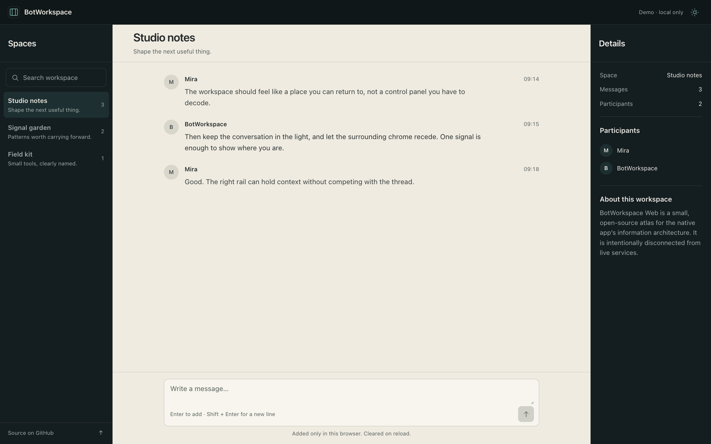
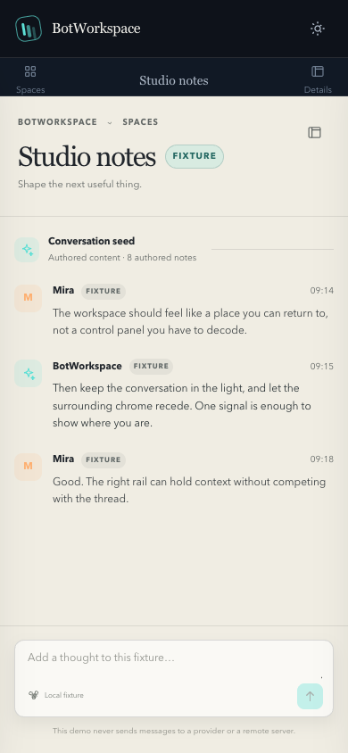

# BotWorkspace Web

> A small, fixture-driven React + Tailwind companion for the BotWorkspace native Mac app.

**[Open the live app](https://botworkspace-frontend.laris.workers.dev)** · Hosted on Cloudflare Workers

BotWorkspace Web is an **open-source UI atlas**, not a hosted AI service. It makes the workspace model legible in a browser with synthetic conversations, a three-pane shell, and a local-only composer. Nothing here requires credentials or sends data to a provider.

Independent project. Not affiliated with Grok and not a copy of proprietary source code.

## The surface



The first viewport keeps the mechanism together: spaces on the left, a readable conversation in the middle, and context on the right. A bounded thread keeps the composer visible instead of making the page an endless scroll.

### Mobile composition



On narrow screens the conversation stays primary. Spaces and details become explicit labelled panels rather than a squeezed desktop layout.

## Included interactions

- Select a space and load its authored fixture conversation.
- Search spaces and message summaries locally.
- Add a local fixture message; the status region confirms that it was not sent anywhere.
- Toggle the ink / soft-light relationship.
- Open mobile Spaces and Details panels.
- Keyboard-visible focus, semantic landmarks, reduced-motion support, and touch-sized controls.

## Stack

- React 19 + TypeScript
- Vite 8
- Tailwind CSS 4 through `@tailwindcss/vite`
- Oxlint

This uses the current Vite React TypeScript template and Tailwind's first-party Vite plugin. The app is a static client-only build so it can deploy to GitHub Pages or any static host.

## Run it

```bash
npm install
npm run dev
```

Useful checks:

```bash
npm run lint
npm run build
```

## Deploy to Cloudflare Workers

This is a static-assets-only Worker, not a Cloudflare Pages project. Only the
Vite output in `dist/` is published; source, memory, and local credentials are not.
There is no server entrypoint or backend binding.

```bash
npm ci
npm run deploy:check # build and validate without uploading
npm run deploy       # rebuild and publish with Wrangler 4.130.0
```

Deployment requires Wrangler authentication. Use `npx wrangler@4.130.0 login`
for local OAuth, or supply a scoped `CLOUDFLARE_API_TOKEN` outside the repository.
Set `CLOUDFLARE_ACCOUNT_ID` when more than one account is available. Do not commit
these values. Git pushes alone do not deploy; run the explicit deploy command.

[`wrangler.jsonc`](./wrangler.jsonc) enables the public `workers.dev` address and
SPA navigation fallback to `index.html`, following
[Cloudflare's Static Assets configuration](https://developers.cloudflare.com/workers/static-assets/).
With this assets-only SPA configuration, unknown paths—including missing asset
paths—return `index.html` with HTTP 200. Verify the actual hashed JS/CSS files
rather than treating an arbitrary 200 response as proof of an asset.

## Contract and visual system

- [`PRODUCT.md`](./PRODUCT.md) — product truth, audience, boundaries, and accessibility.
- [`DESIGN.md`](./DESIGN.md) — the Operate-mode visual system and interaction language.
- [`docs/FRONTEND-SPEC.md`](./docs/FRONTEND-SPEC.md) — scope, view model, behavior, privacy, and verification gates.

The UI is intentionally fixture-first. A future provider-neutral adapter must preserve the same view model and the explicit privacy boundary before any live integration is considered.

## Related project

The native Mac implementation and its screenshot atlas live in [`idea-9sep-wed2026-grok-clone`](https://github.com/nat-build-with-oracle/idea-9sep-wed2026-grok-clone).

## License

MIT-licensed open-source companion project. See [`LICENSE`](./LICENSE) for the full text.
